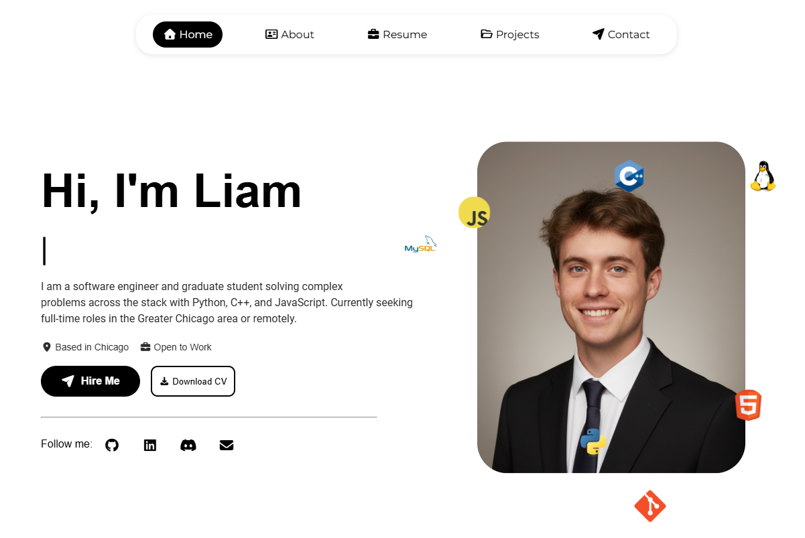

# Personal Portfolio - Liam Pelikan


A responsive, high-performance personal portfolio website designed to showcase software engineering projects, technical skills, and professional experience.



## Live Demo
**[View the Live Site Here](https://liampelikan.github.io)**


---

## Tech Stack
* **Frontend:** HTML5, CSS3, JavaScript
* **Hosting:** GitHub Pages
* **Services:** EmailJS

---

## Installation & Setup
*  **Clone the repository:**
    ```bash
    git clone https://github.com/liampelikan/liampelikan.github.io
    ```
*  **Open `index.html`** in your browser to view the site.

## How to Customize (For Forks)
If you are forking this repo to build your own portfolio, follow this checklist to make it yours:

### 1. Update Personal Info (`index.html`)
* **Title Tag:** Change `<title>Liam Pelikan</title>` (Line 6).
* **All the info:** Replace all of the sections except the contact section with your own information.
* **Social Links:** Update `href` links for GitHub, LinkedIn, and Discord in the Header and Footer.
* **Resume:** Replace `assets/documents/Liam_Pelikan_Resume.pdf` with your own PDF.

### 2. Configure EmailJS (`index.html` & `main.js`) **VERY IMPORTANT**
You have to change this otherwise I will be getting all of your mail:
*  Sign up at [EmailJS.com](https://www.emailjs.com/).
*  Create a **Service** (e.g., Gmail) and a **Template**.
*  **In `index.html` (Line 23):** Replace the key:
    ```javascript
    emailjs.init("YOUR_PUBLIC_KEY_HERE");
    ```
*  **In `js/main.js` (Line 112):** Update your Service and Template IDs:
    ```javascript
    emailjs.sendForm('YOUR_SERVICE_ID', 'YOUR_TEMPLATE_ID', this)
    ```

---
